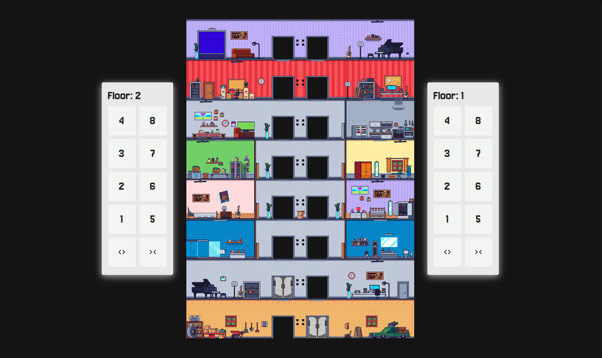

# Elevator Simulator

This is a simple simulation of an elevator system created to demonstrate basic elevator functionalities such as movement between floors, opening and closing doors, and more. This project is designed to be a fun and educational tool for understanding how an elevator works at a fundamental level.

## Screenshot

## Techstack

  
  
  
  
  
  

### 📜 License

This project is licensed under the **Apache 2.0 License** – see the [LICENSE](LICENSE) file for details.
